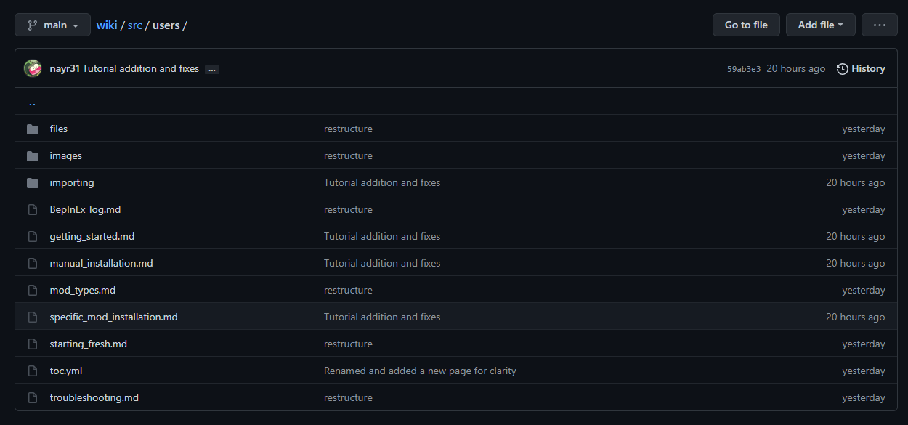
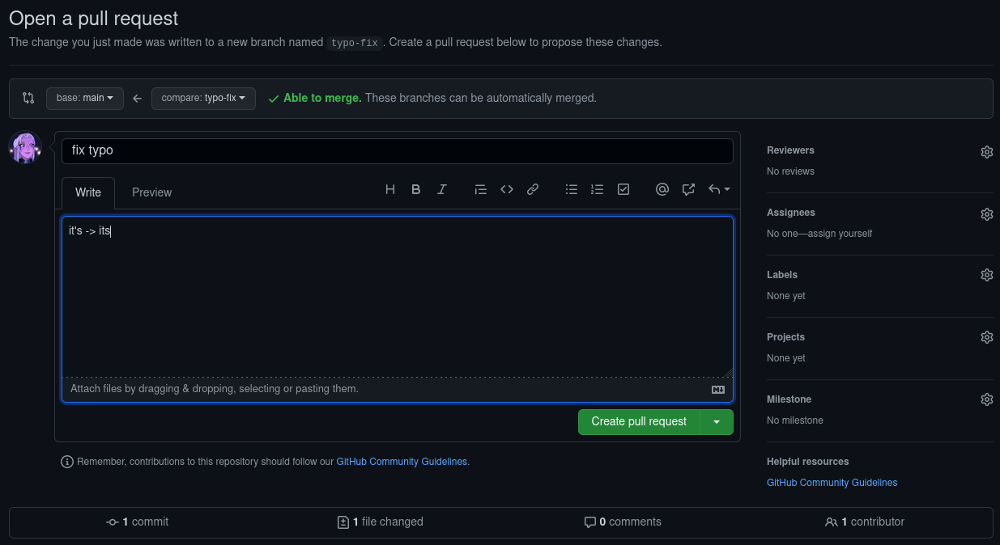

# Contributing

:+1::tada: First off, thanks for taking the time to contribute! :tada::+1:

Everyone is welcome to provide their own guides, tutorials, or propose changes towards the collection of information that the site provides for the community. As your changes are documented through your commit history for your pull request, a moderator will need to approve your changes (meaning that it's a good idea to test your changes!).

If you are new to github and [docfx](https://dotnet.github.io/docfx/index.html), you can request in your pull request (your request for the wiki to pull your changes) for your changes to be tested by a moderator and the necessary measures will be taken.

Now that that's taken care of...

## Forking the repo

In order for you to create changes and propose them, you will need to "check out" a version of the repository. Head on over to [this link](https://github.com/H3VR-Modding/wiki) and click the "Fork" button.

After some time, you will have your own copy of the wiki under your own name.

## Suggesting changes

To suggest a change to a page, simple navigate to the page that you wish to edit on the repo. This can be done easily by taking a look at the url of the page you wish to edit.

Here is an example:
`https://h3vr-modding.github.io/wiki/users/specific_mod_installation.html`

If you see the url, we have our base (`h3vr-modding.github.io/wiki/`), which is our domain (where the repo root is), then a set of folders and files. `users/` means that the page is inside of the `users/` folder, and then the `specific_mod_installation.html` is the file you need to change. With the way that the site works, you will actually be editing a markdown file (so in this case, `specific_mod_installation.md`).

So taking that into account, we get to the following file on the repo:
`src > users > specific_mod_installation.md`

Now that you know where the file is, open it and click on the little pencil icon in the top right of the document box. Now you can edit the page however you like, and you can click the preview button at the top to see how it looks. Keep in mind that some parts of the document are not rendered correctly in this view since it is actually [DocFX Flavored Markdown](https://dotnet.github.io/docfx/spec/docfx_flavored_markdown.html).

Once you are done editing the page, scroll all the way to the bottom and write a descriptive message about what you did and hit the `Commit changes` button. Select "Create a new branch for this commit and start a pull request." Then, give your branch a simple name. Often times, this will overlap with your commit name.

Press the "Propose changes" button. This will open the pull request page, which allows you to describe your changes in further and prettier detail. It should be obvious by your pull request title and description what you have changed.

Once you are ready to submit the request, press the "Create pull request" button. A team member will take a look at your changes, suggest things, or modify it to comply, and then be added to the site.

You can also read [this official Github page](https://docs.github.com/en/github/collaborating-with-pull-requests/proposing-changes-to-your-work-with-pull-requests/creating-a-pull-request) to find out how to submit your changes.

## Adding pages

Adding pages to the website can be a bit tricky, so if you are less tech inclined you can contact one of the H3VR Modding Documentation team members to add the page for you. Simply upload a zip of your [markdown](https://github.com/adam-p/markdown-here/wiki/Markdown-Cheatsheet) file (.md file extension) that follows our [formatting guidelines](formatting.md).

If you want to add pages yourself, there are a few recommended steps to take so that you can easily test your changes and see how it works. Of course, these are only recommended, and you can skip the next header and add pages instead manually through the github interface, just make sure that you follow the [formatting guidelines](formatting.md) in either situation.

### Getting the environment setup

The next parts are up to yourself to figure out, but you now need to start creating files and folders. If you are on windows, the recommended way to do this would be to download [visual studio code](https://code.visualstudio.com).

After that is installed and you pick the dark theme, click on the fork icon (source control window) on the left side, and clone your repository. More information on this process can be found on the [official VSCode documentation](https://code.visualstudio.com/docs/editor/github#_setting-up-a-repository).

It will prompt you to log into your github account before this, after it will display a list of your repositories (which your copy should be in). After selecting it, you will select a location for the folder to be stored on your machine, after which a prompt will ask you to open it.

Congrats! You can now start contributing to new articles on the site. Make sure to follow the examples seen in your file explorer in VSCode to see how things sorted, making sure to follow the [formatting guidelines](formatting.md).

### Building the site for testing

In VSCode, hit the `ctrl + shift + b` buttons. You should have the option to build the site or set the default build task.

Running it will make the terminal appear at the bottom of the screen, showing you if any errors occurred (broken links in orange, build failures in red). If the build failed because of a port already in use, just run it again.

`ctrl + click` on the link that it gives you. It should be `http://localhost:8080`. The site is hosted there, and you can see your contributions to the site. You will need to build each time you want to see your changes.

### Committing your changes

Your fork icon on the left of VSCode should have a number now that you have made changes. On the "Changes" header that lists your files, click the plus icon. Write in a descriptive message into the message field, then click the check-mark to commit your changes.

Once you are done, click on the three dots to open the drop-down menu, then hit push. 

Head on over to [this official Github page](https://docs.github.com/en/github/collaborating-with-pull-requests/proposing-changes-to-your-work-with-pull-requests/creating-a-pull-request) to find out how to submit your changes.
