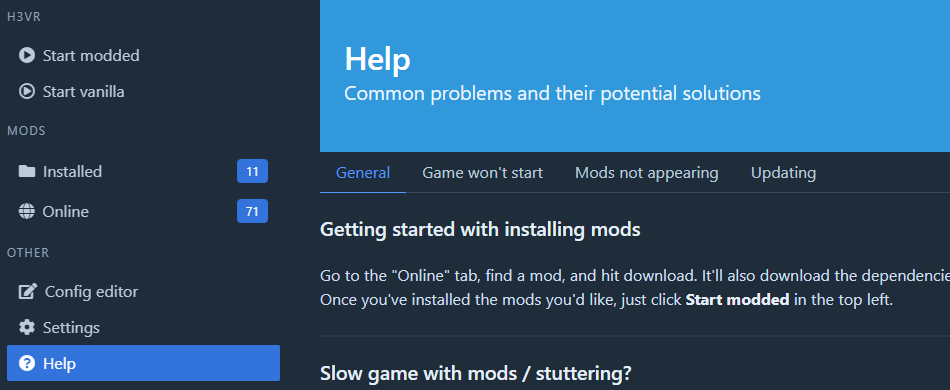

# Getting Started

- [Getting Started](#getting-started)
  - [Thunderstore](#thunderstore)
  - [Installing mods via r2modman](#installing-mods-via-r2modman)
  - [Installing mods not on Thunderstore](#installing-mods-not-on-thunderstore)
  - [Troubleshooting](#troubleshooting)
  - [Configuring your mods](#configuring-your-mods)
  - [Running your game with mods](#running-your-game-with-mods)

## Thunderstore

[**Thunderstore**](https://h3vr.thunderstore.io) is the main site to get mods from.

Thunderstore is the current standard of installing mods, and is meant to be used with the mod manager [**r2modman**](https://h3vr.thunderstore.io/package/ebkr/r2modman/) or [**Thunderstore mod manager**](https://www.overwolf.com/app/Thunderstore-Thunderstore_Mod_Manager). It is ***highly*** recommended to use one of these when installing mods. Since they work essentially the same, whenever you see a reference to r2modman you can exchange it with TSMM.

## Installing mods via r2modman

Please open the [Mod Types](Mod-Types.md) file in another tab and read over it. It contains a list of the three different mod types contained within the modding community.

**NOTE:** If you have installed mods previously from another storefront, please preform a clean install. Guide on how to do it is located [here](Starting-Fresh.md).

**NOTE 2:** Mods are no longer installed to the root H3VR directory! Please read the tutorial carefully.

Once you have installed r2modman and opened it, you will be greeted by a page asking you which game you would like to manage. In our case, we want to manage H3VR so click on that. It will ask you to create a profile or select the default one. Its up to you which you use, the default one cannot be deleted, but comes as an empty profile for new users.

You will then be greeted to the main interface shown below. Every time you want to run the game with mods, you will ned to press the `Run Modded` button in the top left and your game will run with the mods listed under the `Installed` section on the left.

r2modman contains a built in list of mods in their `Online` section. Depending on what you download from the storefront, it will download any other mods it needs to run. This means all you need to worry about is the content mods you are downloading, and not whats needed to run it. The [Mod Types](Mod-Types.md) page goes over the basics on which mods require what. This process also works in reverse, if you were to uninstall a mod that other mods depend on, they will also be uninstalled.

From that `Online` section in r2modman, install anything you want by clicking on it, then by clicking on the `Download` button. Below is a picture of the `Wurstmod` dependency as an example.

## Installing mods not on Thunderstore

Please see the [Mods not on TS](Mods-Not-On-TS.md) doc for more information.

## Troubleshooting

For the most common problems, please see the [Why aren't my mods working?](https://github.com/ebkr/r2modmanPlus/wiki/Why-aren%27t-my-mods-working%3F) page provided by Ebkr.

For less common problems, see the [Troubleshooting](Troubleshooting.md) file for more details. Keep in mind new problems are found every day, and yours will most likely be on this page.

## Configuring your mods

Some mods may come with configuration files to change certain aspects of their behavior. Using r2modman's `Config editor` setting on the left, you can change any configuration files created.

To make these files appear, simply run the game once with the mod fully loaded without errors. If you do have errors that prevent mods from loading, first fix those before trying to change configuration options.

Below is a picture of where the `Config editor` feature is.

## Running your game with mods

To run mods, you **must** press the `Run Modded` button within r2modman or TSMM.

If you would like to run the game modded through steam, making the ease of use and usefulness of profiles irrelevant, please see the bottom of the `General` section of the `Help` menu on the left.

