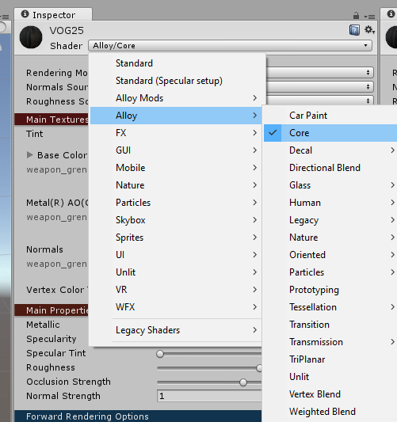

This document is meant as a quick reference guide, and should not be substituted for a comprehensive tutorial.
We recommend you take a look at how to set up [MeatKit](../meatkit/intro.md) first.

## Required/Recommended tools

You need Unity version 5.6.7f1. This is **non-negotiable**. The link to the Unity
version archive can be found [here](https://unity3d.com/get-unity/download/archive).

[AssetStudioGUI](https://github.com/aelurum/AssetStudio/releases/latest) is an extremely useful tool for
exporting packaged meshes and textures.

The [MeatKit Project](https://github.com/H3VR-Modding/MeatKit) contains everything you need to make... pretty must everything.

Once you have installed MeatKit, open up the project.

## Unity Window Types

#### There are a few types of windows inside the Unity editor:

| Window        | Description                                                                                                                                                                                         |
|---------------|-----------------------------------------------------------------------------------------------------------------------------------------------------------------------------------------------------|
| Inspector     | The Inspector window shows you the details of the object you have selected.                                                                                                                         |
| Hierarchy     | The Hierarchy shows the parent child relationships of your objects in the scene.  Objects that are selected here are not saved automatically, and must be applied through the Inspector window. |
| Game          | This window shows what the camera in your scene is seeing. Useful for taking pictures.                                                                                                          |
| Scene         | The Scene is a display of the objects in your hierarchy. You can use the edit tools (move, rotate, etc.) in the top left of the Unity window to modify the objects placed in the scene.         |
| Project       | Commonly known as the Assets Tray, this area shows your file structure and saved prefabs.                                                                                                           |
| Asset Bundles | This window shows what asset labels you have and which items are included in them.  In the build section, you can build your asset labels to be used and shared.                                |

## Importing prefabs

>[!NOTE]
> If you want to contribute, adding an entry on the Advanced Prefab Loader is welcome!

1. Enter and exit Play Mode by clicking on the Play button in the upper center of the Unity Editor, then clicking on it
again when the Editor unfreezes. (Note: If you wish to retain the meshes and materials of your imported objects
at the cost of losing script references after a restart of the Editor, forgo this step)
2. Go to `Meatkit > Prefab Loader`  and click on the `Select Asset Bundle` button on the pop-up. 
3. Navigate to `\steamapps\common\H3VR\h3vr_Data\StreamingAssets` and open the asset bundle with the object you
wish to import into the Hierarchy.
4. Finally, choose the prefab you want to import by clicking on the asset display button, navigating to your desired 
prefab, clicking it and clicking Spawn.

## Importing assets

Importing assets is as easy as copying them to your Unity project. It is recommended to make them under a recognizable
folder, such as `Materials`. This can be done by dragging and dropping them into the Assets tray, or by opening your
OS's file explorer and copying them through there.

Assets can range from textures and meshes to sounds and custom scripts.

**Alloy** is the lighting system that H3VR uses, and because of that we need to create special materials to make sure
that the item you are trying to create renders correctly.

Right click in the assets tray and click `Create > Material` and rename it to the name of the item you are creating.
When you click on it, change the type to `Alloy/Core`.

From here, you need to fill in the three fields in the material. It needs a base/diffuse, a metal texture, and a normal.
If you don't have a metal texture (which is 99% of cases) then you need to make one. Head on over to
the `Material Map Channel Packer` in the window tab.

>[!NOTE]
> This section needs more information. Contributions welcome!

In the window that opens, drag your textures into the required fields. The normal is not required. After you hit
generate, you will obtain a metal texture. Fill you material with your texture sets now (base/diffuse, metal, and
normal).

## Modifying your item

> [!NOTE]
> GameObjects in your Hierarchy window are not saved, make sure to press the "Apply" button in the Inspector to save your changes.

Drag your item (that you should have renamed) into your Hierarchy, and expand it by clicking on the little arrow. You
should see a lot of other items underneath it. Those are the children of your object that make up it.

Depending on the child, you might need to fill in a missing mesh or material depending on what kind of item you are
creating.

When you select your item in the Hierarchy, you should see some green wire boxes. These boxes are physics colliders.
Make sure they are somewhat accurate, but don't spend too much time since they only need to be somewhat accurate.

To add more, you can duplicate ones already made (by right-clicking in the Hierarchy and clicking duplicate) or by
creating an empty game object (also in the Hierarchy) and adding the component you want in the Inspector window.

> [!WARNING]
> Using anything other than sphere, capsule, or box colliders effects performance considerably. Avoid them at all costs.

Everything is dependent on the type of item you are trying to create, which cannot be explained in a guide like this.
You will have to figure out the specifics on your own.

## Required Assets

To make sure your weapon works, you need to give it an Object Wrapper
(can be created with `Assets > Create > Object IDs > Object ID`). The Object Wrapper is
simply an Object ID, something that defines your item.

If you want your item to show up in the spawner, you will need to give it a Spawner Entry. 
This can be done by creating said Spawner Entry via `Assets > Create > MeatKit > Otherloader > Spawner Entry`

And if the item is a firearm:

- Recoil Profile (`Assets > Create > Firearms > RecoilProfile`)
- Firearm Audio Set (`Assets > Create > AudioPooling > FireArmAudioSet`)

## Filling out the specifics

This next section will go over what needs to be filled out in each file detailed above. If you want to duplicate an
already-existing script, you can do that by:
1. Clicking on your desired already-filled-in prefab
2. Finding a field that has the required script filled in (e.g. all Physical Objects (which includes firearms) 
will have it filled in right under the Physical Object Config Header) 
3. Double-clicking the field. This will open the script in the Inspector, from where you can copy the contents however
you want. Note that this will NOT add the script to your project.

### Item ID

Script name: `FVRObject`

The Item ID requires a few fields to be filled out:

Asset Name:
Location of your item relative to your Unity assets path. Example: `Assets/Project/MyGun/MyGun.prefab`

Item ID, Display Name, Spawned From ID:
Identifiers of your item. To avoid confusion, should all be the same.

The rest of the fields should be filled out to your discretion. They are tags that relate to Take and Hold, so if you
want your item to spawn in it, they need to be filled out.

Finally, if you want your item to spawn in TnH, enabled the `O Sple` property.

### Item Spawner Entry

Script name: `ItemSpawnerEntry`

The Item Spawner Entry can be made through the assets tray `Create > MeatKit > Otherloader > SpawnerEntry`,
and the icon is just an image that has its
metadata changed to be a sprite (clicking on the icon and changing the type in the inspector).

Make sure that you have `Is Displayed In Main Entry` and `Is Unlocked By Default` are set to true. This will allow you
to see your item and spawn it. Set its category and sub category so that you can find it. Set the sub heading to something
you want, but it's not required.

Fill out the icon with the one you made (not required), and set the `Item ID` field to the exact same string you used in
the Item ID object just above. Drag your item id object into the `Main Object` field.

### Recoil profile

Script name: `FVRFireArmRecoilProfile`

This is just a bunch of number fields that determine your weapon's recoil.

If you want to simulate your referenced weapon, the follow the following steps:

1. Press pause, then play to spawn prefab load the object.
2. In the Hierarchy, click on the newly cloned weapon.
3. Scroll down in the Inspector window until you find the location of the recoil profile that is required by all
   weapons.
4. Double-click on it.
5. The Inspector should have changed to show your referenced weapon's recoil profile. Take a screenshot
   using `win + shift + s`, or any other snipping tool you may have for a quick reference.

Make sure that you place your recoil profile in both slots in your weapon's main script.

### Audio Profile

Script name: `FVRFirearmAudioSet`

The Audio profile is exactly the same as the recoil profile, double check what your referenced weapon used by following
the similar steps, taking pictures along the way. Make sure that you expand all clip sections and take note of which
fields (such as `prefire`) are filled. Your weapon's audio profile **must** contain a sound in the same field.

AssetStudioGUI is a great tool to use here. Drag and drop the asset bundle you copied into your Unity project into the
ASGUI window and wait for it to load. Select the `Asset List` tab and then search for the sound files that are required.
You can right-click on the sound files and click `Export Selected Assets`, and you can export them straight to your
Unity project to use.

## Building your item

It's currently recommended to use the [MeatKit Build Profile](../meatkit/getting_started/2_build_profile.md) to build 
your mod as a Thunderstore package.
