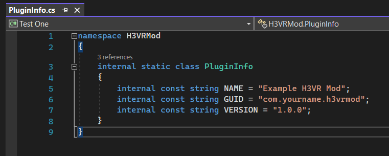

# Introduction to scripting for H3VR
This series of articles will guide you through setting up a BepInEx plugin for H3VR; a pure
code mod. In this first article you will download and open the template project for creating 
your mod.

## Required tools
The only tool you will need for this series of articles is Visual Studio, or another C# IDE.
Any version of Visual Studio will work, if you've previously installed the Unity Editor 5.6.3p4
it will likely have come with VS2017. If this is the case, you can use that. Otherwise, download 
and install [Visual Studio Community 2022](https://visualstudio.microsoft.com/downloads/).

Next, you will need to grab a copy of the template BepInEx plugin for H3VR. This can be downloaded
from [the GitHub page](https://github.com/Maiq-The-Dude/H3VR.EmptyBepInEx) by clicking on the
'code' button in the top right of the page, then selecting 'download zip'.

## Opening the project
With the template project downloaded and extracted, open Visual Studio and on the landing screen
select 'open project or solution' from the right, navigate to `<extracted template>/src/`, and
open `Plugin.sln`.

## Rebranding your project
Now with the project open you will likely want to change the name of it to match what you intend
to make with it. There are two places where you need to change the name. On the right side of the
screen, there is a window called the 'solution explorer'. Inside the solution explorer you should
see a tree of everything contained in the template, you will want to expand this tree so that all
of the files are visible:

The first place you need to change your plugin name is in the `PluginInfo.cs` file. Double click to
open this file. Inside there are three lines with values you will want to change. The name of your
mod, the GUID, and the version. The name of your plugin can be anything, as it's really only used
in the console log. The GUID is a unique identifier for your mod, which usually follows the format
`author.modname`, it's important to not change this after you've published your mod as it's intended
to be permanent. And the version is obviously the version of your mod. When you go to update your
mod you should increment this version number following the [semantic versioning](https://semver.org/)
format.

The second place where you need to change your plugin name will be on the line with the first arrow
which just reads `Plugin`. Right click on this item and select 'Rename'. The name entered here will
become the name of your output plugin file. For consistency, you can just set this to the same name
you entered for your plugin name earlier.

With those set, your mod is now rebranded.

## Building your mod
To confirm everything still builds, go ahead and use the `Build > Build Solution` menu item to build
your plugin. If all goes well this should come back with a successful build. If the build failed,
make sure in your `PluginInfo.cs` file you still have all of the values within double quotes.

After a successful build you will need to navigate to your project folder and locate the output file;
this will be located at `<project folder>/src/<plugin name>/bin/net35/<plugin name>.dll`. There
will be several other files inside this folder, but at the moment this is the only one we care about.

From r2mm / TMM, select a profile and from the settings open up your profile folder, this is where
all of the mods used in the profile are stored. Once opened, go into `BepInEx/plugins/` and copy your
built plugin file into this folder. After copying, go ahead and start your profile from r2mm / TMM.

If everything worked, in the console you should see a line from BepInEx saying that your plugin was loaded.
With that, your project is setup and you're ready to write some code to begin doing things.
